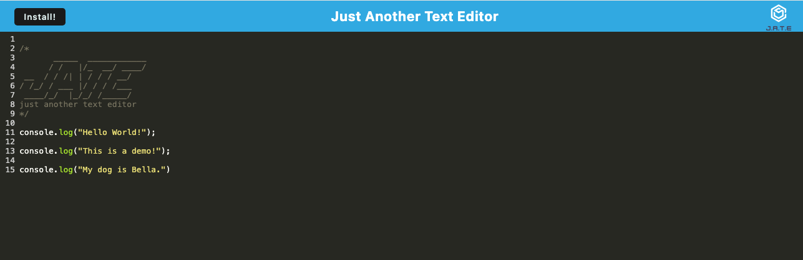

# PWA Text Editor AP

Greetings! PWA Text Editor AP is a simple text editor that runs in the browser. The app is a single-page application that meets the Progressive Web Application (PWA) criteria. The app features a number of data persistence techniques that serve as redundancy in case one of the options is not supported by the browser. The app also functions offline.

## Invoking the application

To invoke the application locally, simply run `npm install` followed by `npm run start` in the terminal.

## Technology

PWA Text Editor AP uses methods for getting and storing data to an IndexedDB database. It uses the node package `idb` as a lightweight wrapper around the IndexedDB API. The app's JavaScript files have been bundled by using webpack and it is deployed through Heroku.

## Using

The app allows developers to create notes or code snippets with or without an internet connection, which can be retrieved for later use. The app meets the following user criteria once it is invoked:

* When a user enters content and subsequently clicks off of the DOM window the content in the text editor is saved with IndexedDB.
* When a user reopens the text editor the content has been retrieved from the IndexedDB.
* When a user clicks the Install button the app is downloaded to their computer.
* When a user loads the app they get a registered service worker using workbox.
* When a user registers a service worker they have static assets pre cached upon loading along with subsequent pages and static assets.

## Screenshot

## Link to Deployed Application

[Here is a link to the deployed application!](https://still-eyrie-95093-c11411e8dfb7.herokuapp.com/)
